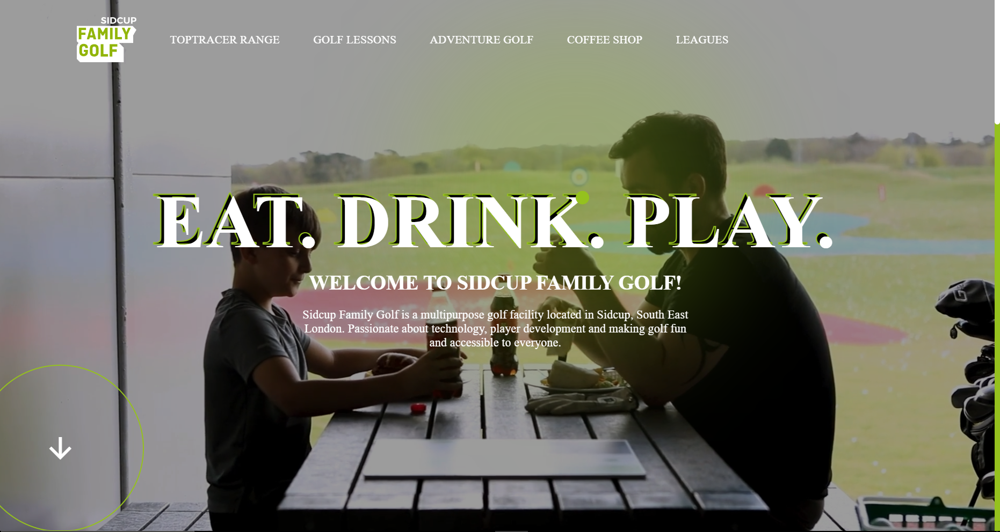

# Sidcup Golf Family Website clone

This project is a clone of the Sidcup Golf Family website, aimed at replicating its features and design for learning purposes.

Original website - [https://sidcup-golf-family.netlify.app](https://sidcup-golf-family.netlify.app/)

My project ---> [https://aryannxroot.github.io/Sidcup_golf_family](https://aryannxroot.github.io/Sidcup_golf_family).

## Website

### Home



## Installation

To get started with the project, clone the repository and install the necessary dependencies:

```bash
git clone https://github.com/aryannxroot/Sidcup_golf_family.git
cd Sidcup_golf_family
```

## Usage 
Open the index.html with live server in vs code. 


## Technologies Used

- **HTML5**: For structuring the web content.
- **CSS3**: For styling components.
- **JavaScript (ES6+)**: Modern JavaScript features.
- **Unsplash API**: For fetching the images from unsplash.

##

## Author

Aryan (@aryannxroot)

## Contributing

Contributions are welcome! Please feel free to submit a Pull Request.

## LICENSE
This project is licensed under the [MIT License](./LICENSE). See the MIT LICENSE file for more information.
